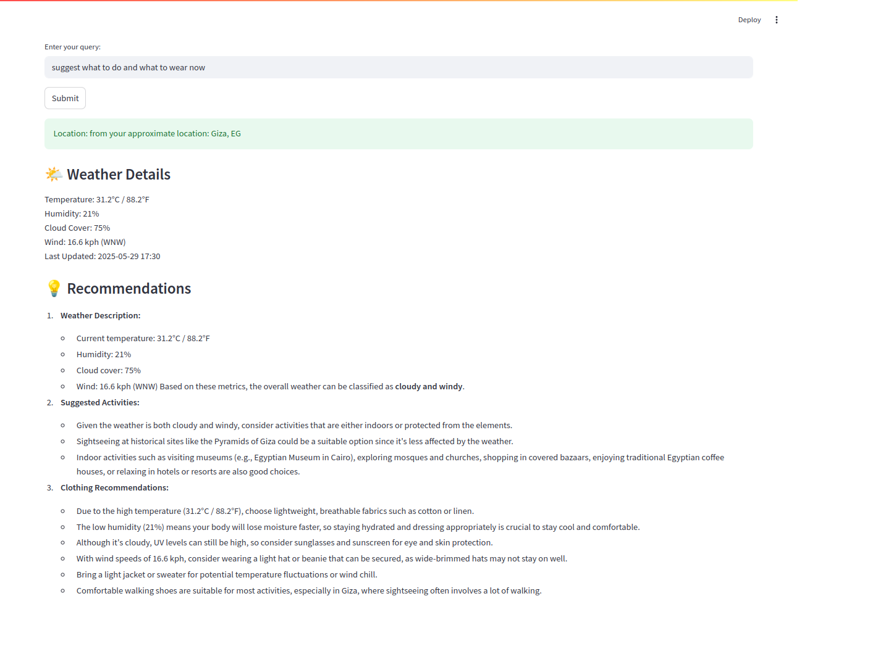

# 🌦️ Weather-Activity Assistant

An interactive Streamlit app that provides personalized weather-based activity and clothing recommendations. It uses a combination of a Large Language Model (LLM), weather API, IP-based location detection, and a PDF knowledge base to give contextual suggestions.

---

## 🧠 Architecture Overview

The system is built using the following key components:

1. **User Query Handling**
   - Streamlit UI captures user input.
   - Country/city is extracted using a prompt-based LLM.

2. **Location Resolution**
   - If the location isn't found in the query, it falls back to IP geolocation.

3. **Weather Data Fetching**
   - Fetches real-time weather using [WeatherAPI](https://www.weatherapi.com/).

4. **Query Enhancement**
   - Enhances the original query with weather metrics and natural language descriptions.

5. **RAG (Retrieval-Augmented Generation)**
   - Uses a vector store (FAISS) and a PDF document to retrieve relevant contextual chunks.
   - Embeds are generated with `sentence-transformers/all-MiniLM-L6-v2`.

6. **Response Generation**
   - A final prompt generates context-aware activity and clothing suggestions.

---

## ✨ Features

- 🌍 Detects location from query or IP
- 🌤 Fetches current weather dynamically
- 📝 Rewrites the query with weather context
- 📚 Uses a PDF knowledge base for retrieval
- 👕 Suggests suitable activities and outfits

---

## 📸 Demo

  

---

## ⚙️ Setup

### 🔧 Prerequisites

- Python 3.8+
- `pip` installed

### 📦 Install dependencies

```bash
pip install -r requirements.txt


### 🚀 Run the app

streamlit run run.py
